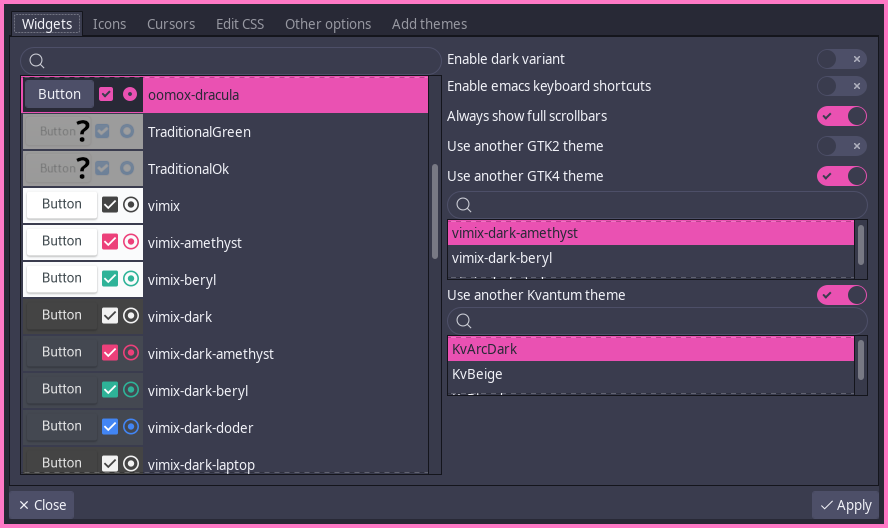

# ThemeChanger


This app is a theme changing utility for Linux, BSDs, and whatnots.
It lets the user change GTK 2/3/4, Kvantum, icon and cursor themes, even for libadwaita apps, edit GTK CSS with live preview, and set some related options.
It also lets the user install icon and widget theme archives.

## Features
- Set the GTK 3 theme, sync the GTK2, GTK4, Kvantum themes with it or choose another one for each of these toolkits
- Set the icon theme
- Set the cursor theme, and tweak the cursor's size
- Set all these themes with a special searchable selector with previews for GTK3, icon and cursor themes
- Set various options like whether buttons have images or not
- Instantaneously apply your setting changes to the running applications in GNOME, Cinnamon, Mate, XFCE, LXDE using lxsession, or using [xsettingsd](https://github.com/derat/xsettingsd) (you must download xsettingsd and run it in the background) for those that don't use GTK desktop environments
- Edit GTK CSS with instantaneous feedback of the changes made
- Install new widget or icon themes from archives available e.g. at https://gnome-look.org

# Installation
## Arch Linux & friends
Install the `themechanger-git` package from the AUR the way you like it. For instance, I like it this way:
```
yay -S themechanger-git
```
## Fedora
[](https://copr.fedorainfracloud.org/coprs/alex11br/ThemeChanger/package/themechanger/)

Install `themechanger` from the [`alex11br/ThemeChanger` COPR](https://copr.fedorainfracloud.org/coprs/alex11br/ThemeChanger/), like this:
```
sudo dnf copr enable alex11br/ThemeChanger
sudo dnf copr install themechanger
```
## Nix(OS)
Install the `themechanger` package from nixpkgs, like this:
```
nix-env -iA nixos.themechanger # On NixOS
nix-env -iA nixpkgs.themechanger # On any other platform
```
## From source
Make sure you have installed PyGobject, Gtk3, GLib (for the app running); headers thereof, glib-compile-resources, meson, ninja (for the installation process). For reference, this is how you get the required dependencies on Ubuntu:
```
sudo apt install python3-gi libglib2.0 libgtk-3.0 # runtime dependencies
sudo apt install meson gcc libglib2.0-dev-bin python3-dev python-gi-dev libxcursor-dev libgdk-pixbuf2.0-dev # build-time dependencies
```

In the folder with the source (obtainable e.g. by running `git clone https://github.com/ALEX11BR/ThemeChanger`) run `meson build`, then `ninja -C build install`, and you're ready to go!

# TODOs
- Add more options to set (see [further reference](https://docs.gtk.org/gtk3/class.Settings.html#properties))
- Add theme remover
- Add a client for OCS-compatible websites like gnome-look.org, tailored for downloading (and automatically installing) themes (see [API reference](https://freedesktop.org/wiki/Specifications/open-collaboration-services/) and [a reference project](https://www.opencode.net/dfn2/pling-store-development))
- Copy global theme files locally so that flatpak apps can use them (maybe?)
- Option for configuring named colors
- Clean the code overall
- Warn when `GTK2_RC_FILES` is set
- Don't rely on spawning commands for e.g. querying processes
